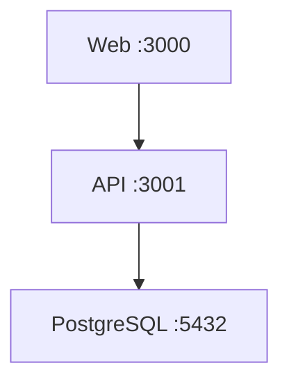

# Docker Setup Guide

Comprehensive guide for running the fullstack application in Docker containers.

---

## Table of Contents

- [Overview](#overview)
- [Prerequisites](#prerequisites)
- [Quick Start](#quick-start)
- [Environment Configuration](#environment-configuration)
- [Development Workflow](#development-workflow)
- [Production Deployment](#production-deployment)
- [Service Architecture](#service-architecture)
- [Common Commands](#common-commands)
- [Troubleshooting](#troubleshooting)
- [Best Practices](#best-practices)

---

## Overview

This project uses Docker Compose to orchestrate multiple services:

- **postgres**: PostgreSQL 16 database
- **api**: NestJS REST API server
- **web**: Next.js web application

The setup supports both development (with hot-reload) and production configurations.

---

## Prerequisites

### Required Software

- **Docker**: Version 24.0+ ([Install Docker](https://docs.docker.com/get-docker/))
- **Docker Compose**: Version 2.20+ (included with Docker Desktop)
- **pnpm**: Version 9.0+ (for local development)
- **Node.js**: Version 20+ (for local development)

### Verify Installation

```bash
docker --version
docker-compose --version
pnpm --version
node --version
```

---

## Quick Start

### 1. Environment Setup

Copy the example environment file and configure it:

```bash
cp .env.example .env
```

Edit `.env` and update the following critical variables:

- `BETTER_AUTH_SECRET`: Generate a secure secret (see [Environment Configuration](#environment-configuration))
- `POSTGRES_PASSWORD`: Set a strong password for production
- `DATABASE_URL`: Update if using a different database configuration

### 2. Start All Services (Production Mode)

```bash
pnpm docker:up
```

This starts all services in detached mode:
- API: http://localhost:3001
- Web: http://localhost:3000
- PostgreSQL: localhost:5432

### 3. Start All Services (Development Mode with Hot-Reload)

```bash
pnpm docker:up:dev
```

This starts services with volume mounts for hot-reload during development.

### 4. Run Database Migrations

After starting the services, run Prisma migrations:

```bash
# Enter the API container
pnpm docker:exec:api

# Inside the container, run migrations
cd libs/api
pnpm exec prisma migrate dev --name init

# Exit the container
exit
```

### 5. Verify Services

Check that all services are running:

```bash
pnpm docker:ps
```

Access the applications:
- Web Application: http://localhost:3000
- API Health Check: http://localhost:3001/health
- PostgreSQL: localhost:5432 (credentials in .env)

---

## Environment Configuration

### Generating Secure Secrets

Generate a secure `BETTER_AUTH_SECRET`:

```bash
openssl rand -base64 32
```

Copy the output to your `.env` file:

```env
BETTER_AUTH_SECRET=<generated-secret>
```

### Environment Variables Reference

See [.env.example](.env.example) for a complete list of environment variables.

**Critical Variables**:

| Variable | Description | Example |
|----------|-------------|---------|
| `POSTGRES_USER` | PostgreSQL username | `postgres` |
| `POSTGRES_PASSWORD` | PostgreSQL password | `strongpassword` |
| `POSTGRES_DB` | Database name | `fullstack` |
| `DATABASE_URL` | Full connection string | `postgresql://...` |
| `BETTER_AUTH_SECRET` | Auth encryption key | `<32+ char string>` |
| `API_PORT` | API server port | `3001` |
| `WEB_PORT` | Web app port | `3000` |

### Multiple Environments

Create separate `.env` files for different environments:

```bash
.env                 # Local development
.env.staging         # Staging environment
.env.production      # Production environment
```

Load specific environment:

```bash
docker-compose --env-file .env.staging up
```

---

## Development Workflow

### Hot-Reload Development

Start services with volume mounts for live code updates:

```bash
pnpm docker:up:dev
```

This configuration:
- Mounts source code directories
- Watches for file changes
- Automatically rebuilds on save
- Preserves node_modules

### Viewing Logs

View logs for all services:

```bash
pnpm docker:logs
```

View logs for a specific service:

```bash
pnpm docker:logs:api
pnpm docker:logs:web
pnpm docker:logs:postgres
```

### Accessing Containers

Open a shell in a container:

```bash
# API container
pnpm docker:exec:api

# Web container
pnpm docker:exec:web

# PostgreSQL container
pnpm docker:exec:postgres
```

### Database Management

Access PostgreSQL CLI:

```bash
pnpm docker:exec:postgres
# or directly:
docker-compose exec postgres psql -U postgres -d fullstack
```

Common PostgreSQL commands:

```sql
\l              -- List databases
\dt             -- List tables
\d <table>      -- Describe table
SELECT * FROM user;
```

### Running Prisma Commands

```bash
# Access API container
pnpm docker:exec:api

# Generate Prisma Client
cd libs/api
pnpm exec prisma generate

# Run migrations
pnpm exec prisma migrate dev --name <migration-name>

# Open Prisma Studio
pnpm exec prisma studio
```

---

## Production Deployment

### Building Production Images

Build optimized production images:

```bash
pnpm docker:build
```

Build without cache (clean build):

```bash
pnpm docker:build:no-cache
```

### Running in Production

1. Update `.env` with production values:
   - Set `NODE_ENV=production`
   - Use strong passwords
   - Configure proper CORS origins
   - Enable secure cookies

2. Start services:

```bash
pnpm docker:up
```

3. Run production migrations:

```bash
docker-compose exec api sh -c "cd libs/api && npx prisma migrate deploy"
```

### Production Checklist

- [ ] Strong `BETTER_AUTH_SECRET` (32+ characters)
- [ ] Strong `POSTGRES_PASSWORD`
- [ ] `NODE_ENV=production`
- [ ] `USE_SECURE_COOKIES=true`
- [ ] Proper `CORS_ORIGINS` configured
- [ ] Database backups configured
- [ ] Health checks enabled
- [ ] Logging configured
- [ ] SSL/TLS certificates configured (if needed)

---

## Service Architecture

### Service Dependencies



### Docker Compose Structure

```
docker-compose.yml          # Production configuration
docker-compose.dev.yml      # Development overrides
apps/api/Dockerfile         # API multi-stage build
apps/web/Dockerfile         # Web multi-stage build
.dockerignore               # Exclude files from build context
.env                        # Environment variables
```

### Build Stages

Both Dockerfiles use multi-stage builds:

1. **base**: Base Node.js image with pnpm
2. **dependencies**: Install all dependencies
3. **build**: Build the application
4. **development**: Development image with hot-reload
5. **production**: Minimal production image

---

## Common Commands

### Service Management

```bash
# Start all services (detached)
pnpm docker:up

# Start in development mode (hot-reload)
pnpm docker:up:dev

# Stop all services
pnpm docker:down

# Stop and remove volumes (data will be lost!)
pnpm docker:down:volumes

# Restart all services
pnpm docker:restart

# Restart specific service
pnpm docker:restart:api
pnpm docker:restart:web

# View running services
pnpm docker:ps
```

### Building

```bash
# Build all images
pnpm docker:build

# Build specific service
docker-compose build api
docker-compose build web

# Build without cache
pnpm docker:build:no-cache
```

### Logs and Debugging

```bash
# View all logs
pnpm docker:logs

# View specific service logs
pnpm docker:logs:api
pnpm docker:logs:web
pnpm docker:logs:postgres

# View last 100 lines
docker-compose logs --tail=100 api

# View logs since 1 hour ago
docker-compose logs --since 1h api
```

### Cleanup

```bash
# Remove stopped containers and networks
docker-compose down

# Remove volumes too (data will be lost!)
pnpm docker:down:volumes

# Full Docker cleanup (use with caution!)
pnpm docker:prune
```

---

## Troubleshooting

### Port Already in Use

**Error**: `port is already allocated`

**Solution**:
1. Check what's using the port:
   ```bash
   # Windows
   netstat -ano | findstr :3001

   # macOS/Linux
   lsof -i :3001
   ```

2. Stop the conflicting process or change the port in `.env`:
   ```env
   API_PORT=3002
   WEB_PORT=3001
   ```

### Database Connection Issues

**Error**: `Can't connect to PostgreSQL`

**Solutions**:
1. Ensure postgres is healthy:
   ```bash
   docker-compose ps
   ```

2. Check postgres logs:
   ```bash
   pnpm docker:logs:postgres
   ```

3. Verify DATABASE_URL in `.env`

4. Wait for postgres to be fully started (health check)

### Build Failures

**Error**: `failed to solve with frontend dockerfile.v0`

**Solutions**:
1. Clear Docker cache:
   ```bash
   pnpm docker:build:no-cache
   ```

2. Check .dockerignore isn't excluding required files

3. Verify Dockerfile syntax

### Permission Issues

**Error**: `permission denied` when accessing containers

**Solutions**:
1. Run Docker with appropriate permissions
2. Check file ownership in volumes
3. On Linux, add user to docker group:
   ```bash
   sudo usermod -aG docker $USER
   ```

### Hot-Reload Not Working

**Problem**: Code changes not reflected in development mode

**Solutions**:
1. Ensure using docker-compose.dev.yml:
   ```bash
   pnpm docker:up:dev
   ```

2. Check volume mounts in docker-compose.dev.yml

3. Restart the specific service:
   ```bash
   pnpm docker:restart:api
   ```

### Container Crashes

**Error**: Container exits immediately after start

**Solutions**:
1. Check logs:
   ```bash
   pnpm docker:logs:api
   ```

2. Verify environment variables

3. Check health check configuration

4. Inspect container:
   ```bash
   docker inspect fullstack-api
   ```

---

## Best Practices

### Development

- Use `docker-compose.dev.yml` for development with hot-reload
- Keep `.env` updated with team (via `.env.example`)
- Regularly prune unused images and volumes
- Use named volumes for data persistence

### Production

- Use multi-stage builds to minimize image size
- Run as non-root user (already configured)
- Use secrets management (AWS Secrets Manager, Azure Key Vault)
- Enable health checks on all services
- Configure proper logging and monitoring
- Use volume backups for database
- Implement rolling deployments

### Security

- Never commit `.env` files
- Use strong passwords and secrets
- Enable HTTPS in production
- Configure CORS properly
- Keep Docker images updated
- Scan images for vulnerabilities

### Performance

- Use Docker BuildKit for faster builds
- Leverage layer caching
- Minimize image size
- Use `.dockerignore` effectively
- Configure resource limits if needed

---

## Additional Resources

- [Docker Documentation](https://docs.docker.com/)
- [Docker Compose Documentation](https://docs.docker.com/compose/)
- [NestJS Docker Guide](https://docs.nestjs.com/recipes/docker)
- [Next.js Docker Guide](https://nextjs.org/docs/deployment#docker-image)
- [Prisma Docker Guide](https://www.prisma.io/docs/guides/deployment/deployment-guides/deploying-to-docker)

---

## Support

For issues or questions:
- Check [Troubleshooting](#troubleshooting) section
- Review Docker Compose logs
- Consult project documentation in [CLAUDE.md](./CLAUDE.md)
- Open an issue on GitHub
